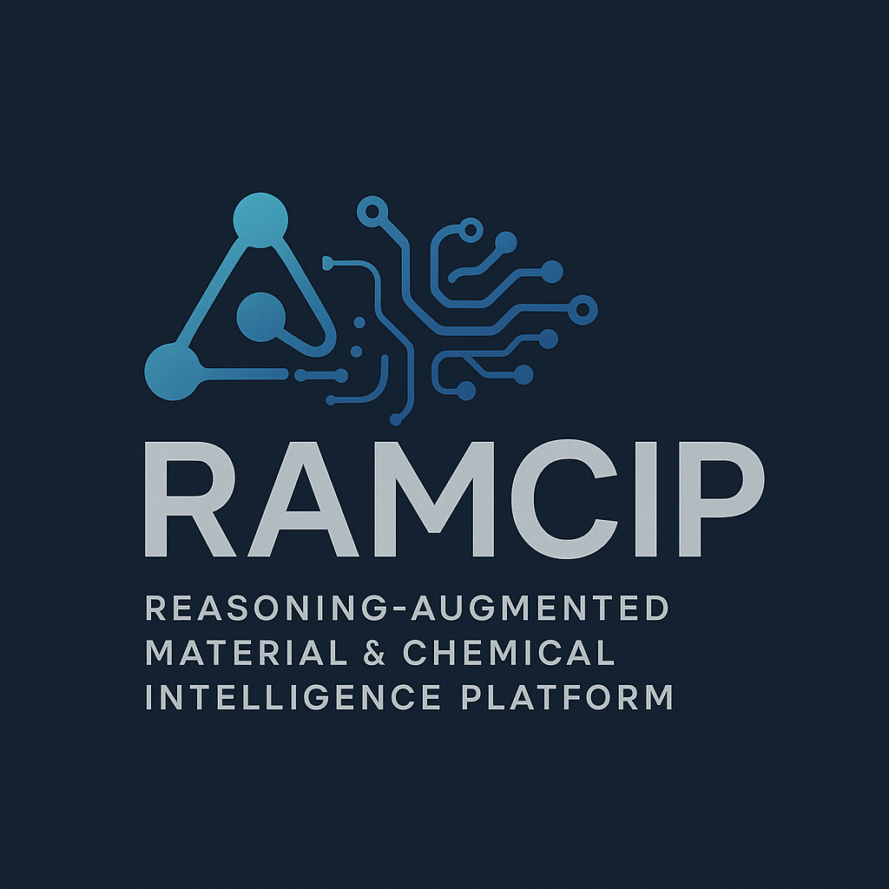

  

# DeepIndustry

**DeepIndustry** is an intelligent, reasoning-centric AI platform purpose-built for advanced applications in chemical engineering and materials science. By combining domain-specific knowledge with powerful large language models (LLMs) equipped with **chain-of-thought reasoning**, DeepIndustry enables scientific and industrial users to accelerate innovation with depth, structure, and explainability.

---

## 🧠 What Is DeepIndustry?

At its core, DeepIndustry is more than just a platform—it's a **reasoning engine** for physical sciences.

Built upon a proprietary **domain-adapted LLM**, DeepIndustry supports a range of cutting-edge workflows in:

- **Molecular and material design** with AI-suggested candidates  
- **Retrosynthetic planning and process pathway optimization**  
- **Structure–property prediction** through multimodal and symbolic reasoning  
- **Simulation pre-screening** guided by large-model inferences  
- **Multi-step experiment planning** with transparent thought processes  
- **Natural language querying of scientific knowledge bases and databases**

DeepIndustry bridges symbolic chemical logic and deep neural representation learning. It empowers scientists to ask **“why,” “how,” and “what if”**—and receive intelligent, structured, and actionable answers.

---

## 🔍 Logo Concept

The DeepIndustry logo (see `logo.png`) is a visual embodiment of the platform’s intelligence-driven mission:

- The stylized acronym **D.E.E.P.** contains dynamic lines, mechanical cues, and directional flows—symbolizing how abstract AI logic moves through real-world industrial systems.  
- Its clean and professional design language evokes trust, precision, and advanced engineering, aligned with DeepIndustry’s vision for the future of science and manufacturing.  
- The visual symmetry of circuits, arrows, and motion paths reflects the **chain-of-reasoning** mechanisms central to the platform’s architecture.

---

## 🌍 Vision & Impact

DeepIndustry is designed for real-world application by:

- **Materials scientists**
- **Chemical engineers**
- **Process designers**
- **AI-augmented R&D teams**
- **Industrial AI researchers**

Whether deployed in academic labs or industrial R&D pipelines, DeepIndustry transforms traditional workflows by making **deep reasoning** accessible, explainable, and productive.

---

## 📘 License

The DeepIndustry logo and branding assets in this repository are licensed under the  
**Creative Commons Attribution-NonCommercial 4.0 International (CC BY-NC 4.0)**.

> You may use the logo and associated media for **non-commercial** DeepIndustry-related content with proper attribution.  
> For commercial use or partnership branding, please contact the team directly.

---

## 📬 Contact

For inquiries, demos, or collaborations:

📧 **Email:** contact@deepindustry.ai  
🌐 **Website:** [www.deepindustry.ai](https://www.deepindustry.ai) *(coming soon)*  

---

Thank you for your interest in DeepIndustry.  
We believe the future of science is not just automated — it’s **reasoned**.
